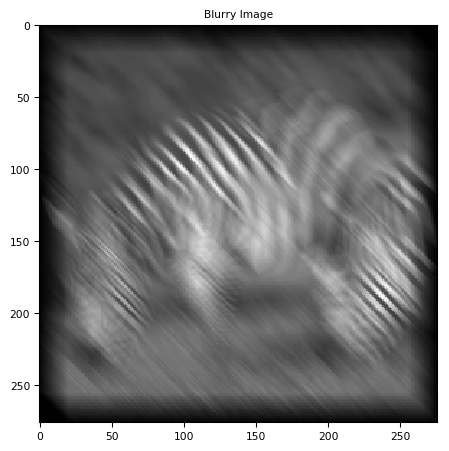
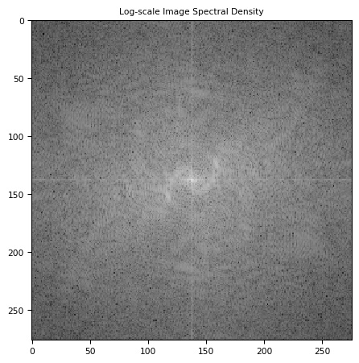
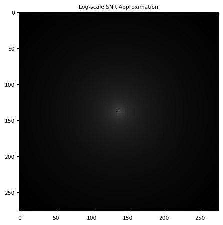
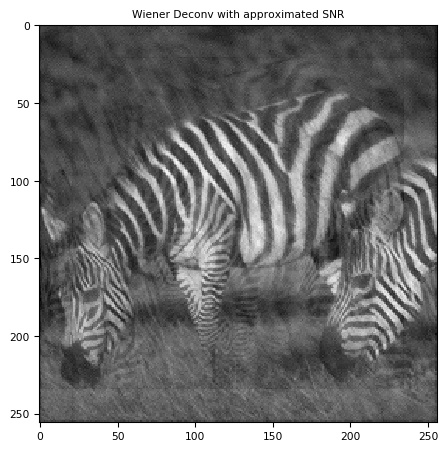
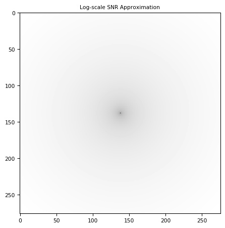
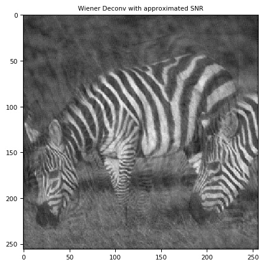
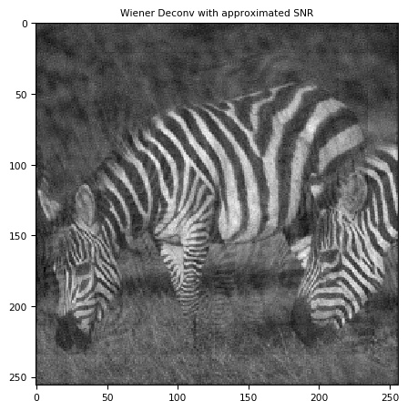

# Project 1: Image Deblur using Deconvolution Algorithm

Main code: [Deconv.py](Deconv.py)

Full report: [report.pdf](HW1_report.pdf)

Python packages used in implementation: skimage, scipy, numpy, matplotlib

Image source: BSDS500 dataset

 

## Objective

To implement several deconvolution algorithms to recover the original image from the blurred observation, and compare the performance of them.

## Instructions

1. Generate blurred image from original image using 2D convolution and Gaussian noise.

	  

	(Left to right: original image, noiseless image, noisy image)

2. Apply naive deconvolution, Wiener deconvolution on blurred in frequency domain.

3. Estimate frequency-dependent Signal-Noise Ratio (SNR) by analyzing the power spectral density of images.

4. Experiment with different approximation of SNR function for Wiener Filter algorithm.

## Evaluation

Evaluation methods: two image similarity metrics: peak signal-to-noise ratio (PSNR) and structural similarity (SSIM) index.

The results are as follows:

| Deconvolution Algorithm | PSNR | SSIM |
|:-----------------------:|:----:|:----:|
|Baseline|16.6020|0.4104|
|Naïve Deconvolution|11.2365|0.0233|
|Wiener: known SNR|24.7730|0.8450|
|Wiener: |22.7635|0.7459|
|Wiener: |26.5565|**0.8084**|
|Wiener: |24.4619|0.7193|
|Wiener: |22.7547|0.7484|
|Wiener: |23.9514|0.7409|

## Visualization

| SNR function | log-scale SNR image | deblurred image |
|:------------:|:-------------------:|:---------------:|
| Known SNR from original image |  |  |
|  |  |  |
|  |  |  |
|  |  |  |
|  |  |  |
|  |  |  |

 

Full report see: [report.pdf](HW1_report.pdf)
