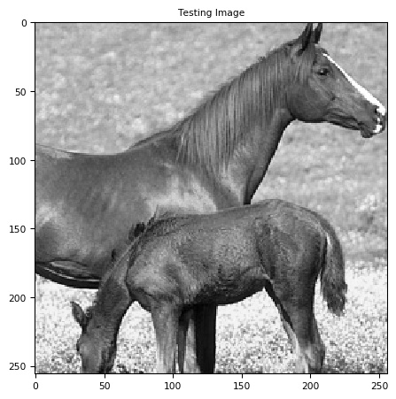
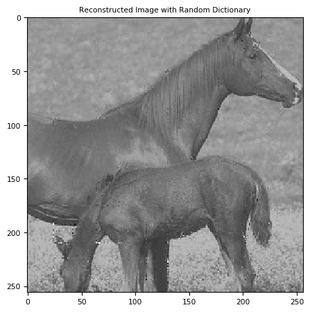
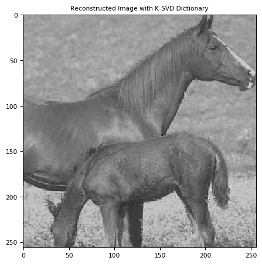

# Project 2: Image Inpainting using Sparse Coding and Dictionary Learning

Main code: [Inpainting.py](Inpainting.py)

Full report: [report.pdf](HW2_report.pdf)

Python package used in implementation: skimage, scipy, sklearn, numpy, matplotlib, cv2

Image source: BSDS500 dataset

 

## Objectives

To use Orthogonal Matching Pursuit (OMP) and K-SVD algorithm to learn sparse representation dictionary from a given image for an image inpainting task, where our goal is to remove the extra text content on the image.

## Instructions

1. Prepare inpainted images with a mask map.

2. Split the image into 8×8 pixel block patches for sparse coding problem, considering the dimension of images.

3. Apply OMP function to reconstruct block patches.

4. Implement K-SVD algorithm to learn a sparse dictionary from an train image to apply on reconstruction of test images.

## Evaluation

Evaluation metrics are: PSNR and SSIM.

| Algorithm | PSNR | SSIM |
|:---------:|:----:|:----:|
|baseline|20.3874|0.7089|
|OMP with random initialization|16.9079|0.8355|
|OMP with K-SVD|18.4620|0.8906|

## Visualization

Original image and test image:

 

Inpainted image using OMP with random initialization and K-SVD:

 

 

Full report see: [report.pdf](HW2_report.pdf)
