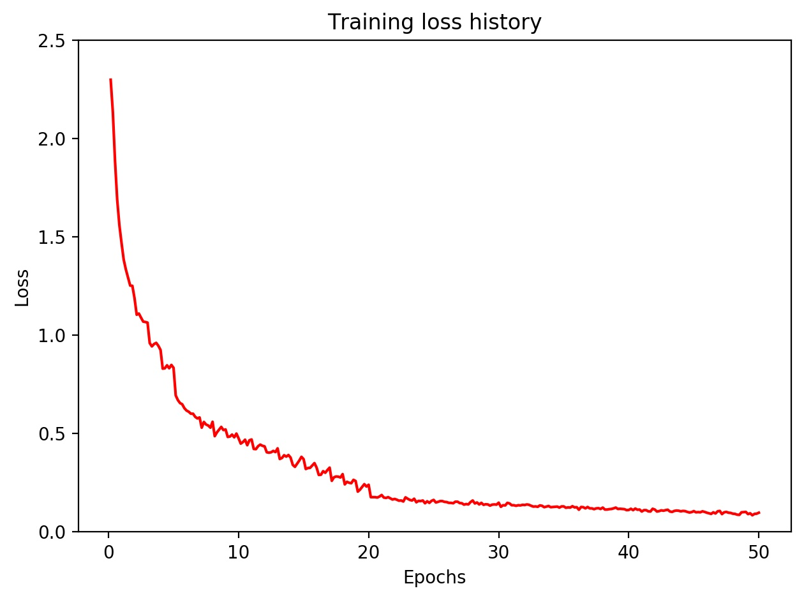
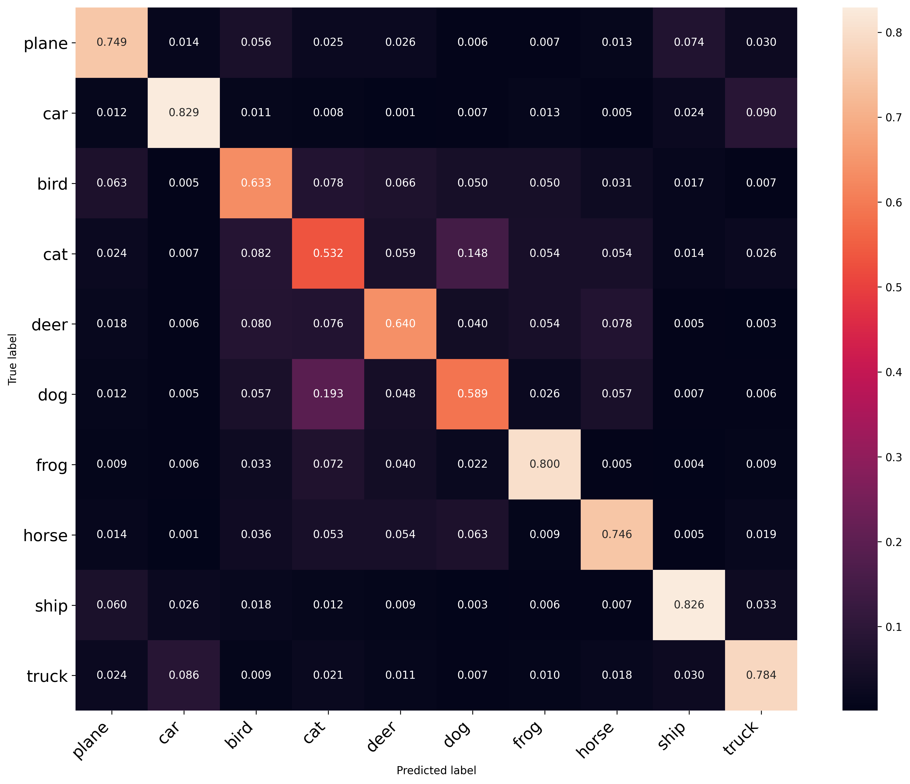

# Project 3: Image Classification using Convolutional Neural Networks (CNN)

Main code: [Classification.py](Classification.py)

Full report: [report.pdf](HW3_report.pdf)

Python package used in implementation: PyTorch

Image source: CIFAR-10 dataset

 

## Objectives

To build a CNN to conduct a multi-class image classification task on the CIFAR-10 dataset using PyTorch.

## Instructions

1. Design a CNN such that
    1. ReLU is the activation function
    2. cross entropy loss is the loss function
    3. only consists of convolutional layers and fully-connected layers
    4. only contains 6 layers

2. Evaluate the classification performance using model accuracy on training and testing set.

## Results

### CNN pipeline

   Convolutional layer (in_channels = 3, out_channels = 8, kernel_size = 3)

=> ReLu => Maxpool

=> Convolutional layer (in_channels = 8, out_channels = 32, kernel_size = 2)

=> ReLu => Maxpool

=> Convolutional layer (in_channels = 32, out_channels = 64, kernel_size = 2)

=> ReLu => Maxpool

=> Fully-connected layer (in_channels = 64\*3\*3, out_channels = 256)

=> ReLU

=> Fully-connected layer (in_channels = 256, out_channels = 84)

=> ReLU

=> Fully-connected layer (in_channels = 84, out_channels = 10)

### Evaluation

Training loss history:

Confusion matrix:

Average model accuracy on the training set is: 98.38%

Average model accuracy on the testing set is: 72.04%

 

Full report see: [report.pdf](HW3_report.pdf)
